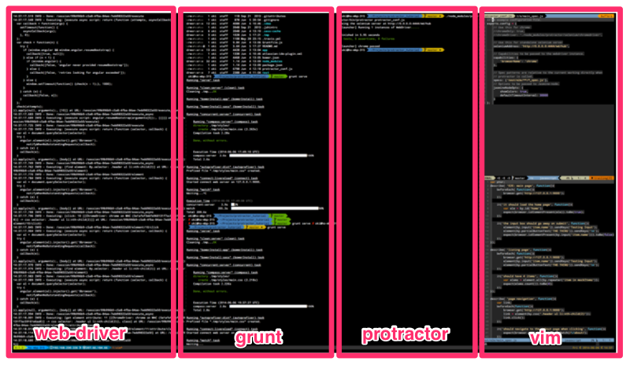
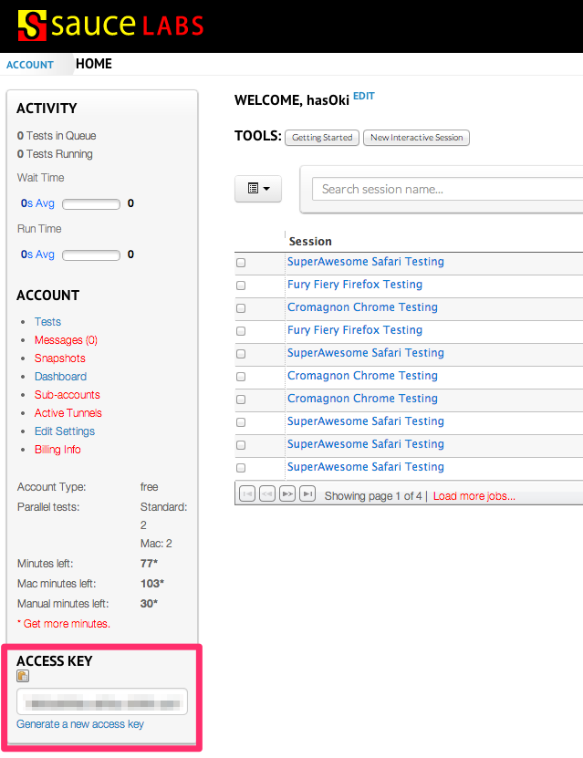
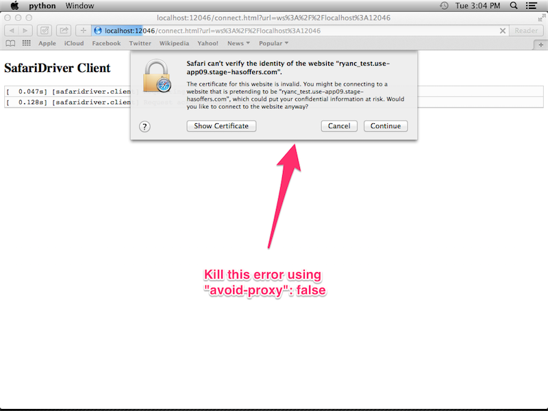

Protractor Tutorial
===================

Protractor is a E2E testing using Selenium. It will test using black box and 
design to simulate end user web page access perspective. Functionality of the page 
element and work flow of the application is the crucial part of the testing.

##Why Protractor
Protractor is a match made in heaven for AngularJS. Besides having the selenium 
DOM targeting capability, it also has capability to select element based on the 
Angular binding attributes ( e.g. ng-model, ng-repeat, ng-bind, etc. )

##Installation
You can install the protractor as global stand alone app using 

```shell
$ npm -g install protractor
```

or locally

```shell
$ npm install protractor 
```

Protractor also require a webdriver to run it's testing, luckyly Protractor comes 
with the webdriver-manager to download the necessary browser driver file. 
Depending on your protractor installation you can either access your 
webdriver-manager inside your project `node_modules/` to run this command:

```shell
$ ./node_modules/protractor/bin/webdriver-manager update
```
	
The script will download the files that needed to run Selenium. After download you 
can test if the webdriver properly downloaded and installed by typing:

```shell
$ ./node_modules/protractor/bin/webdriver-manager start
```

Once you have it running without error you already to do your testing.
	
##Configuration
Protractor receive one input file as their config file to start testing.
You can get the sample configuration file from inside protractor example folder, 
you can copy it as your base configuration.

	$ cp ./node_modules/protractor/example/chromeOnlyConf.js protractor_conf.js
	
Here is the sample protractor config
```javascript
exports.config = {
  // SauceLab Login, uncomment this area if you want to use Sauce Labs
  //sauceUser        : '<your_sauce_lab_user_name>',
  //sauceKey         : '<your_sauce_lab_generated_key>',

  // Use this for chrome
  //chromeOnly: true,
  //chromeDriver: './node_modules/protractor/selenium/chromedriver',

  // Use this for standalone selenium server
  seleniumAddress: 'http://0.0.0.0:4444/wd/hub',

  // Capabilities to be passed to the webdriver instance.
  capabilities   : {
    'browserName': 'chrome'
  },

  // Spec patterns are relative to the current working directly when
  // protractor is called.
  specs          : ['test/e2e/**/*_spec.js'],

  // Options to be passed to Jasmine-node.
  jasmineNodeOpts: {
    showColors            : true,
    isVerbose             : true,
    defaultTimeoutInterval: 30000
  }
};
```

For more available configuration options you can access this file 
`./node_modules/protractor/referenceConf.js`

You can define the `baseUrl` attribute inside your config file and call it from
your test code by using `browser.baseUrl`.

_In your `protractor_conf.js`_
```javascript
// in your protractor_conf.js
exports.config = {
...
  baseUrl: 'http://localhost:9000',
...
}
```
_and In your test code_
```javascript
...
browser.get(browser.baseUrl);
...
```

This will come handy if you want to use the same `protractor_conf.js` to test
different environment. You can pass the override baseUrl in the command line.
```shell
./node_modules/protractor/bin/protractor protractor_conf --baseUrl <new env. url>
```

At the moment you start collecting a pile of spec in one folder, that the time you
need to start thinking of separating your test specs into **suite**. By using
*suite* you can easily test partial part of your whole test suites and focus just
on certain part of the test one a time. 
Here is how to define suites in your config file.
```javascript
...
  suites: [
    login    : 'test/e2e/login/**/*_spec.js',
    dashboard: 'test/e2e/dashboard/**/*_spec.js',
    myAccount: 'test/e2e/myAccount/**/*_spec.js',
    offers   : 'test/e2e/offers/**/*_spec.js',
    reports  : 'test/e2e/reports/**/*_spec.js',
    search   : 'test/e2e/search/**/*_spec.js',
    tools    : 'test/e2e/tools/**/*_spec.js'
  ]
...
```
After you setup your suites, you can test on individual suites using the command
line:
```shell
./node_modules/protractor/bin/protractor protractor_conf --suite <suite_name>
```
It will just run `login` suite and ignoring other suite. The caveat of using suite
is that you need to make sure that each suite is idempotent and not dependent on
the previous suite to run before the current suite can be tested correctly.


##Running Your First Test
In your terminal, you will need to run 3 things: 

- `webdriver-manager`
  Protractor comes with
- your web server that you want to test ( in this tutorial I run it using 
`grunt serve` )
- `protractor`

I am using [tmux](http://tmux.sourceforge.net/) to manage my terminal instances 
like this:




##Writing Your First Test

####protractor_conf.js
Here is the protractor config file for this tutorial.
```javascript
// An example configuration file.
exports.config = {
    // Use this for chrome 
    //chromeOnly: true,
    //chromeDriver: './node_modules/protractor/selenium/chromedriver',

    // Use this for standalone selenium server
    seleniumAddress: 'http://0.0.0.0:4444/wd/hub',
    
    // Capabilities to be passed to the webdriver instance.
    capabilities: {
        'browserName': 'chrome'
    },

    // Spec patterns are relative to the current working directly when
    // protractor is called.
    specs: ['test/e2e/**/*_spec.js'],
    // Options to be passed to Jasmine-node.
    jasmineNodeOpts: {
        showColors: true,
        defaultTimeoutInterval: 30000
    }
};
```

###Basic Testing
####Testing For Correct Page Using Existing Element
Let's test if the website show the correct home page. We want to test if the
server is serving the right page, one way to test it is by checking for the home
element ID in the page ( you can also check for page title ).
Start with the standard jasmine test case

```javascript
describe('E2E: main page', function(){
});
```

We are going to start by telling web driver to open the target website ( in this
tutorial is `http://127.0.0.1:9000` ). `browser.get()` will do that for you. Read
more about [`browser.get` here][ref_browser_get]

    browser.get('http://127.0.0.1:9000');

We wrap the line within `beforeEach` to prepare the page before we test it.

```javascript
describe('E2E: main page', function(){
    beforeEach( function(){
        browser.get('http://127.0.0.1:9000');
    });
});
```

I added the `#home` element in my home page view for the purpose of this tutorial,
we are going to check if this element exist on the page.
To select the element, protractor has `element()`
and `by()` function to help us.
Now we can test for the element `#home` exist on the page by using
`browser.isElementPresent()`. 
You can read more about [`browser.isElementPresent()` here][ref_isElementPresent].

```javascript
it('should load the home page', function(){
    var ele = by.id('home');
    expect(browser.isElementPresent(ele).toBe(true));
});
```

Run your protractor to test the script and see the Success message( or failure ).

Continue on, we can test other element, such as the input element. 
Here is the steps for the test:

- We want to have and input button and a button -  use `by.input` and `sendKeys`
- When user type to the input button and click the button - use
  `by.partialButtonText` and `sendKeys('\n')`
- It will remove the input box and replace it with a list of item - check using
  `browser.isElementPresent()`

In this example, we are selecting the button using `by.partialButtonText()`, you
can read more about [`by.partialButtonText` here][ref_partialButtonText].  
We can use `sendKeys` to enter text to the selected element. 
Use `\n` to simulate the **enter key**. You can read more about 
[`sendKeys` here][ref_sendKeys].

```javascript
it('the input box should go away on submit', function(){
    element(by.input('item.name')).sendKeys('Testing Input');
    element(by.partialButtonText('THE THING')).sendKeys('\n');
    expect(browser.isElementPresent(by.input('item.name'))).toBe(false);
});
```

You can now run the protractor again to see your passing / failing test.

If you've been following all the steps, here is the final code from this section 
of tutorial:
```javascript
describe( 'E2E: main page', function(){
    beforeEach( function(){
        browser.get('http://127.0.0.1:9000');
    });

    it('it should load the home page', function(){
        var ele = by.id('home');
        expect(browser.isElementPresent(ele)).toBe(true);
    });

    it('the input box should go away on submit', function(){
        element(by.input('item.name')).sendKeys('Testing Input');
        element(by.partialButtonText('THE THING')).sendKeys('\n');
        expect(browser.isElementPresent(by.input('item.name'))).toBe(false);
    });
});
```

####Testing For List Element Using AngularJS Binding
Protractor was created to help us do E2E testing on AngularJS application, it's
equipped with additional selector to select element based on AngularJS specific
binding / model. In this section we are going to write a test that utilized that
capability.

In this example we are going to select the element that was created using
`ng-repeat`. Protractor has a `by.repeater` selector that we can use.  
When selecting multiple element, you need to use `element.all` to get an array of
elements.
```javascript
var elems = element.all(by.repeater('item in mockItems'));
```
Once you get the elements array you can do `count()` to check for array length.

Here is the code for this section.
```javascript
describe( 'listing page', function(){
    beforeEach( function(){
        browser.get('http://127.0.0.1:9000');
        element(by.input('item.name')).sendKeys('Testing Input');
        element(by.partialButtonText('THE THING')).sendKeys('\n');
    });

    it('should have 4 items', function(){
        var elems = element.all(by.repeater('item in mockItems'));
        expect(elems.count()).toBe(4);
    });
});
```

####Testing For Page Navigation Using URL and Element Attribute
Another way to check for a correct page being loaded into the browser is by
checking their URL, you can achive this by using `browser.getCurrentUrl()` and
match them using regular expression
```javascript
expect(browser.getCurrentUrl()).toMatch(/\about/);
```
Checking for a class or atribute of an element also anoter way to check if a
button clicked / hover or changed. You can interact with Element by clicking on it
using `.click()` command.

```javascript
...
var link = element(by.css('.header ul li:nth-child(2)'));
link.click();
...
expect(link.getAttribute('class')).toMatch(/active/);
...
```

This is the last describe section to test the url and element attributes.

```javascript
describe( 'page navigation', function(){
    var link;
    beforeEach(function(){
        browser.get('http://127.0.0.1:9000');
        link = element(by.css('.header ul li:nth-child(2)'));
        link.click();
    });

    it('should navigate to the /about page when clicking', function(){
        expect(browser.getCurrentUrl()).toMatch(/\/about/);
    });

    it('should add the active class when at /about', function(){
        expect(link.getAttribute('class')).toMatch(/active/);
    });
});
```

###Steping Up A Notch
As you can see from the code above, you can pile a bunch of page testing in one 
testing config file. 
It will grow nasty pretty quick and become unreadable. Another way to manage the 
the test case is by separating the selector and test into separate page class.

```javascript
function IndexPage() {
  this.button = element(by.id('button1'));
  this.message = element(by.binding('messageText'));

  this.get = function () {
	browser.get('/#');
  };

  this.clickButton = function () {
	this.button.click();
  };

  this.getTitle = function () {
	return browser.getTitle();
  };

  this.getMessageText = function () {
	return this.message.getText();
  }
}

module.exports = IndexPage;
```

And in the main spec file you import the class in.

```javascript
var IndexPage = require('./IndexPage');

describe("hello-protractor", function () {

  //Create the object from the imported class
  var page = new IndexPage();

  beforeEach(function() {
      // Call the testing you define in the class 
      page.get();
  });

  describe("index", function () {
    it("should display the correct title", function () {
    	// Another test from the class
      	expect(page.getTitle()).toBe('hello protractor');
    });

    it("should display the message when button clicked", function () {
  		// Testing the click button by calling the function in the class
      	page.clickButton();

      	expect(page.getMessageText()).toBe('button 1 clicked');
    });
  });
});
```
Using this method your testing code is more readable and you can extends similar
page class to keep the same behaviour checks and not copy pasting a bunch of
repeated code in multiple page files.

###Testing Protractor Interactively
Protractor comes with this script, `elementexplorer.js` in the protractor bin 
folder, this code will run protractor testing in interactive mode:

```shell
node ./node_module/protractor/bin/elementexplorer.js <urL>
```

This one comes handy when you setup the test suite for the first time and studying 
the DOM selector.

###Stepping Through Protractor Test
To step through your protractor testing you can use the debug mode in protractor

```shell
protractor debug <your-e2e-config-file.js>
```

Protractor has its own debugger command to pause the testing process. Use
`browser.debugger()` to pause during the protractor test.

###Using Mock in Protractor
//TODO: Write about using $httpBackend Proxy to pass the mock data to protractor
test https://github.com/kbaltrinic/http-backend-proxy

##Protractor Cheat Sheet
Here is some most common api that you can use to test your website E2E:

###Global Variables
- [browser](https://github.com/angular/protractor/blob/master/docs/api.md#webdriverwebdriver) 
- [element](https://github.com/angular/protractor/blob/master/docs/api.md#elementfinder)
- [by](https://github.com/angular/protractor/blob/master/docs/api.md#protractorby)
- [protractor](https://github.com/angular/protractor/blob/master/docs/api.md#api-protractor)

###Selector
####Generic Selector
- [element](https://github.com/angular/protractor/blob/master/docs/api.md#elementfinderprototypeelement)
- [Select by css](https://github.com/angular/protractor/blob/master/docs/api.md#elementfinderprototype)
- [Select by tag name](https://github.com/angular/protractor/blob/master/docs/api.md#elementfinderprototype)
- [Select by id]()

####AngularJS Selector
- [Select by Model]()
- [Select by Binding]()
- [Select by Repeater]()
- [Select by Button Text]()
- [Select by Partial Button Text]()
- [Select by Partial CSS]()

####Function Prototype
- [sendKeys()]()
- [browser.actions().mouseMove(...).perform()]()
- [click()]()
- [isDisplayed]()
- [browser.isElementPresent]()
- [browser.get]()
- [browser.getCurrentUrl]()
- [browser.debugger]()
- [browser.sleep]()


##More Settings
###Testing Against Multiple Browser
If you are feeling confident with your code and want to test it against multiple 
browser you can set it up using:

```javascript
multiCapabilities: [{
 	'browserName': 'firefox'
}, {
 	'browserName': 'chrome'
}]
```

You can also pass chrome-specific option by passing it as `chromeOptions` property:

```javascript
capabilities: {
  	'browserName': 'chrome',
  	'chromeOptions': {
		'args': ['show-fps-counter=true']
  	}
},
```

###Testing Non-AngularJS Website Using Protractor
Even if the website is not an AngularJS website, you can still test the web page
using WebDriver instance in the browser object.

```javascript
var driver = browser.driver;
// driver.findElement( ... );
```

###Taking Web Page Snapshots
If you want to take a _selfie_ of your website you can do it using 
`browser.takeScreenshot()`.

Here is the sample usage:

```javascript
// at the top of the test spec:
var fs = require('fs');

// ... other code

// abstract writing screen shot to a file
function writeScreenShot(data, filename) {
	var stream = fs.createWriteStream(filename);

	stream.write(new Buffer(data, 'base64'));
	stream.end();
}

// ...

// within a test:
browser.takeScreenshot().then(function (png) {
	writeScreenShot(png, 'exception.png');
});
```

##Automate With Grunt
To make your life easier, you can get `grunt-protractor-runner` and you can add 
the protractor section in your `Gruntfile.js` 

```javascript
protractor: {
    options: {
          configFile: "protractor-config.js”, //your protractor config file
          keepAlive: true, // If false, the grunt process stops when the test fails.
          noColor: false, // If true, protractor will not use colors in its output.
          args: {
              // Arguments passed to the command
          }
      },
    chrome: {
        options: {
              args: {
                  browser: "chrome"
              }
          }
    },
    safari: {
        options: {
            args: {
                browser: "safari"
            }
        }
    },
    firefox: {
        options: {
            args: {
                browser: "firefox"
            }
        }
    }
}
```

You can then run the test individually or better yet you can run it concurrently 
using `grunt-parallel`.
Install the concurrent plug-in in your project root directory using:

	$ npm install grunt-concurrent --save-dev

Register each browser test as separate test

```javascript
grunt.registerTask('protractor-chrome', ['protractor:chrome']);
grunt.registerTask('protractor-safari', ['protractor:safari']);
grunt.registerTask('protractor-firefox', ['protractor:firefox']);
```

Call the registered tasks inside the concurrent settings:

```javascript
concurrent:{
	protractor_test: ['protractor-chrome', 'protractor-safari', 'protractor-firefox']
}
```

Add a new task in your `Gruntfile.js`

```javascript
grunt.registerTask('protractor-e2e', ['concurrent:protractor_test']);
```

Now you can call the protractor test easily using `grunt protractor-e2e` and all 
of 3 browser will run the test concurrently.

###But, there is more ... 
You can even add the task inside the watch list, so every time you change the test 
case / code, the testing will be triggered automatically, but use it with caution.
Install the watch plug in, if you have not already, using
	
	$ npm install grunt-contrib-watch --save-dev
	
and add the e2e settings inside the `watch`section:

```javascript
...
  e2eTest: {
    files: ['e2e/{,*/}*.js',
      '<%= yeoman.app %>/scripts/{,*/}*.js',
      '<%= yeoman.app %>/{,*/}*.html',
      '.tmp/styles/{,*/}*.css',
      '<%= yeoman.app %>/images/{,*/}*.{png,jpg,jpeg,gif,webp,svg}'],
    tasks: ['protractor-e2e']
  }
...
```

and **BOOM**

##Start and Stop WebDriver-Manager Automatically from Grunt
We can add some automation to start and stop the web driver  by using
`grunt-protractor-webdriver`, you can install the plugin using npm:
```shell
npm install grunt-protractor-webdriver --save-dev
```
Then you can add `protractor_webdriver` task in you grunt config:
```javascript
...
  protractor_webdriver: {
    options: {
      noColor: false, // If true, protractor will not use colors in its output.
      path   : './node_modules/protractor/bin/'
    },
    start  : {keepAlive: true},
    stop   : {keepAlive: false}
  },
...
```
Once you have the `protractor_webdriver` running, you can appends and prepends the 
testing process with starting and stopping the webdriver in the queue.
```javascript
...
  grunt.registerTask('protractor-chrome', [
    'protractor_webdriver:start',   // start the webdriver here
    'protractor:local:chrome',      // do your thing
    'protractor_webdriver:stop'     // stop the webdriver here
  ]);
...
```
By doing this automation, it will prevent us from creating 'zombie' service
because we forgot to `kill` the service after we finished using selenium.

You can read more about this plugins [here](https://github.com/seckardt/grunt-protractor-webdriver).

##Testing Using Sauce Labs

###What is Sauce Labs
Sauce labs is and online service where you can rent test server ( by the minutes ) 
to do your testing. You can do JS unit testing and E2E unit testing by sending the
request to their Sauce Lab server. Sauce Lab also provides you with the recording 
and the snap shot of your E2E testing.

###Protractor + Sauce Labs === Awesome Sauce
Thanks to protractor, testing using Sauce Lab is just as easy as adding the Sauce
Lab credential in you protractor config file `protractor_conf.js`. You can get
your unique key from your Sauce Lab Account Home. Don't forget to comment out the
selenium address to start using Sauce Labs selenium server.



```javascript
// Don't forget to comment out this property
// seleniumAddress: 'http://127.0.0.1:4444/wd/hub',

sauceUser        : '<your_sauce_lab_user_name>',
sauceKey         : '<your_sauce_lab_generated_key>',
```

After you change the config file you can call protractor again from command line (
you can also use grunt ). You can watch the on going test by loging in to
SauceLabs and click on the running sessions, you can watch it as a a streaming
video. After a session is done, you can play the replay of the session or visit
the screen shot of the testing process.

With Sauce Labs you can name your session and specify browser / os type by adding 
`"name"`, `"os"` and `"browserName"` parameter in the testing capabilities object. 
For more accepted keys information you can read it 
[here](https://docs.saucelabs.com/reference/test-configuration/#accepted-keys).

```javascript
...
multiCapabilities: [
    {
        "name"       : "SuperAwesome Safari Testing",
        "os"         : "os X 10.9",
        "version"    : "7",
        "browserName": "safari",
        "avoid-proxy": false
    },
    {
        "name"       : "Fury Fiery Firefox Testing",
        "browserName": "firefox"
    },
    {
        "name"       : "Cromagnon Chrome Testing",
        "browserName": "chrome"
    }
],
...
```

###I was Stuck on ...
####My Protractor still connecting to my local web driver server not Sauce Labs
Check your config file and make sure that you not decalring any webdriver address
and only have sauce lab login credential in your config file.

####I can't connect through my office firewall
Go to Starbucks and run it from there, JUST KIDDING. I believe this is the typical
problem that most company have, accessing their local internal server and test it
using remove selenium farm. SauceLabs has the solution for that, they have
[sauceConnect](https://docs.saucelabs.com/reference/sauce-connect/).

Just download their CLI app and you can follow the instruction on how to run it,
in my case:
```
bin/sc -u <saucelab_user_id> -k <saucelab_token>
```
More available options can be read 
[here](https://docs.saucelabs.com/reference/sauce-connect/).  
After your run your SauceConnect, you can run your protractor saucelab testing
again and watch the tunnel doing it works.


####Safari can't open selfsign SSL
When I tried to run my protractor on Sauce Lab using Safari, the test is failing
because it always show error on the failing SSL and timing out since it never going 
through the testing steps.



Solve this problem by adding `"avoid-proxy"` parameter in the browser capability
object and only use Safari V7 and above.

```javascript
...
{
    "name"       : "SuperAwesome Safari Testing",
    "os"         : "os X 10.9",
    "version"    : "7",
    "browserName": "safari",
    "avoid-proxy": false
},
...
```

##Tesing Using ES6
Add this code in your spec files, to skip the precompile to es6 process when you 
want to use es6 in your protractor spec code. 
```javascript
// compile the es6 if the require code comes from e2e folder
var traceur = require('traceur');
traceur.require.makeDefault(function(filename){
  return filename.indexOf('<your es6 folder>') !== -1;
});
var ClassName = require('./classFile')['ClassName']
```
and export your class in your class file using new ES6 `export` keyword
```javascript
export class ClassName{
  constructor(){
    ...
  }
  ...
}
```
No more grunt tasks to precompile your ES6, just code and see it happening in your
test flow.
Make sure that you have `traceur` in your global level so you can include it in 
your run time using `require`. If you don't have `traceur` in your global level
you can install it using
```javascript
npm install -g traceur
```

##Additional Reading

- [Introduction to Protractor](https://docs.google.com/a/hasoffers.com/file/d/0BwDWzYJ-4RpAQnNRLXM3QVFPMjg/edit) - Highlevel overview of Functional Test ( E2E Testing ) and how Protractor can help you to do that.
- [Practical Protractor Tutorial](http://www.ng-newsletter.com/posts/practical-protractor.html) - Zero to somewhat-ProtractorHero in one page, I am using example from this resource to write this tutorial.
- [Protractor for AngularJS](http://ramonvictor.github.io/protractor/slides) - Great slide presentation by Ramon Victor about protractor, longer than the previous tutorial but totally worth reading.
- [Egghead Tutorial](https://egghead.io/series/learn-protractor-testing-for-angularjs) - Fast and easy tutorial about protractor, only 9:16 long.
- [Protractor API](https://github.com/angular/protractor/blob/master/docs/api.md) - List of protractor available functions.
- [bonus video](http://www.sophia.org/tutorials/measuring-angles-with-a-protractor--4) - This is not that kind of _protractor_ tutorial.


[ref_browser_get]: https://github.com/angular/protractor/blob/master/docs/api.md#api-protractor-prototype-get
[ref_isElementPresent]: https://github.com/angular/protractor/blob/master/docs/api.md#api-protractor-prototype-iselementpresent
[ref_partialButtonText]: https://github.com/angular/protractor/blob/master/docs/api.md#api-protractorby-prototype-partialbuttontext
[ref_sendKeys]: https://github.com/angular/protractor/blob/master/docs/api.md#api-webdriver-webelement-prototype-sendkeys

